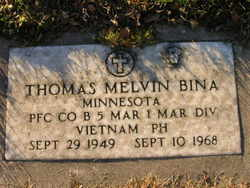
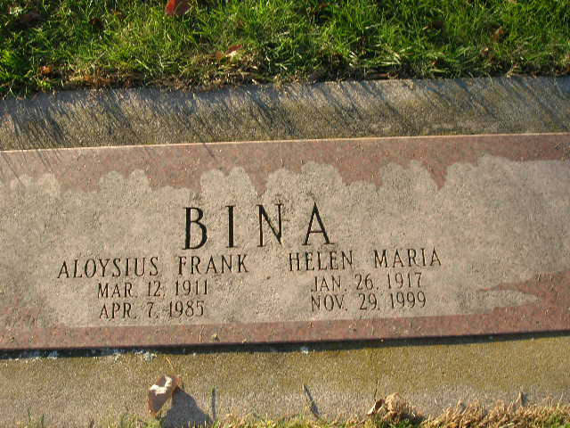
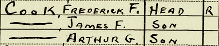
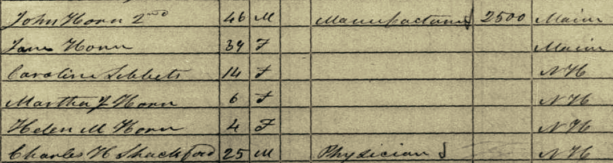
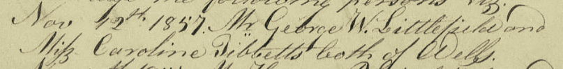
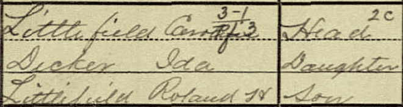
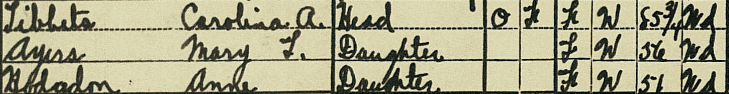

# Erin's family narrative (Maternal)

## Rosemary Bina (--> Lynch) - mother
born:   
married: Gordon Lynch   

### Children
1. Katherine Anne
1. Erin Alison
1. Zachary Adam

### Places of residence

------------------

## Helen Cook (--> Bina) - grandmother
born: January 26, 1917 (Norwich, CT)  
married: Aloysius Francis Bina (b. Iowa)  
died: November 29, 1999 (Pine City, Minnesota)

### Children
1. Joan
1. Margaret Shirley (b. February 2, 1939 in Davenport Iowa [birth record](1-Bina/Margaret-Bina-birth-record.jpg))
1. 
1. Thomas Melvin (b. September 29, 1949 in Pine City, MN; d. September 10, 1968 in Quàng Nam, Vietnam)
1.
1.
1.
1.
1. 
1. Matthew Charles (b. October 4, 1950 in Chisago, Minnesota (record number 1950-MN-040195))
1. David James (b. February 4, 1952 in Chisago, Minnesota (record number 1952-MN-052009))
1. Michael John (b. April 24, 1953 in Chisago, Minnesota (record number 1953-MN-033718))
1. Daniel Robert (b. January 11, 1956 in Chisago, Minnesota (record number 1956-MN-016398))
1. Raymond Paul (b. February 5, 1957 in Chisago, Minnesota (record number 1957-MN-022462))
1. Rosemary Louise (b. October 20, 1958 in Chisago, Minnesota (record number 1958-MN-018720))
1. Mark Anthony (b. June 12, 1960 in Chisago, Minnesota (record number 1960-MN-029091))

### Places of residence
* 1920 - Franklin Town, New London, CT (farm)
* 1930 - 39 Spruce Street, Norwich Town, Norwich City, New London, CT
* 1935 - San Diego, CA
* 1940 - 1824 Central Ave, Bettendorf, Scott, Iowa

### Records

At the time of Margaret's birth in 1939, Helen lived at 1814 Central Avenue, Davenport, Iowa. Birth was at Mercy Hospital and was full-term. Aloysius' occupation listed as W.P.A. for past 7 months. WPA (Works Progress Administration or Works Projects Administration) workers carried out public works projects, including construction. Helen listed as housewife. Delivery was spontaneous, at 6am.

In 1940, Helen and Aloysius lives with daughters Joan (4) and Margaret (1) at 1824 Central Avenue, Bettendorf, Scott, Iowa. Aloysius had finished high school, while Helen had completed two years of high school. Aloysius was employed as a factory machinist and had worked 16 hours the week of March 24-30. He worked 52 weeks in 1939, and had received $1000 in wages. He worked for a private employer. The median income for a man in 1940 was $956. 

* 1940 Census
	* [Family search link](https://www.familysearch.org/ark:/61903/3:1:3QS7-L9M1-NZJ)
	* [Census page](1-Bina/1940-census-Helen-Cook.jpg)

 

In 1968, Helen's son Thomas Melvin was killed in Vietnam. Arriving in Vietnam 27 June 1968 Thomas was assigned Bravo Company, 1st Battalion, 5th Marine Regiment, 1st Marine Division. Thomas died as a result of gunshot wounds to the body from hostile small arms fire. He was 18 years old. 

Helen's third youngest child, Raymond, died from a fall while working construction around 10am on October 17th, 1974, at the age of 17. At the time, he was living with wife Cassandra Lee Bina at Kenwood Terrace, B17 in Mora, Minnesota. Raymond had previously served in the Marine Corps. 

* [Raymond's death record](1-Bina/Raymond-Bina-death-record.jpg)

Helen died November 29th, 1999 in Pine City, Minnesota (record number 1999-MN-034479), aged 82.

------------------

## Julia A. Gray (--> Cook) - great-grandmother
born: October 24, 1889
married:  
divorced:  
died:  

### Children
1. James F. (1911 - ) 
1. Arthur G. (1913 - )
1. Florence E. (1916 - ) 
1. Helen M. (1918 - )
1. Ruth A. (1919 - )

### Places of residence
* 1889 - Ledyard, CT
* 1900 -  
* 1910 - 
* 1920 - Franklin Town, New London, CT (farm)
* 1930 - 39 Spruce Street, Norwich Town, Norwich City, New London, CT
* 1940 - 45 Main Street, Norwich, New London, CT

### Records

* 1889 birth record
	* [FamilySearch link](https://www.familysearch.org/ark:/61903/3:1:3Q9M-C9BT-W9PJ-G)
	* [record page](3-Gray/Julia-Gray-birth-original.jpg)

Julia is the fourth child of Helen and James Gray. She was born October 24th, 1889 in Ledyard, CT. At time of birth, her parents were 29 (James) and 27 (Helen) years old. James was working as a farmer. Recorder appears to have noted doctor's name in the space for mother's occupation. Delivering doctor is something like "Chipman/Chapman & Gray"?

* 1900 Census
	* [FamilySearch link](https://www.familysearch.org/ark:/61903/3:1:S3HY-6D3Q-K1?i=13)
	* [Census page](3-Gray/Julia-Gray-1900-census-original.jpg)

In 1900, Julia lived with her parents and five siblings in Ledyard Town, New London, CT. Helen is marked
as mother of six children, all living. James is still farming, and rents the farm. Julia and all of her 
siblings are at school, except for two year old Fred. Julia can read and write and spent 9 months at 
school in the previous year (at least that's what was reported). 

Of the 1218 residents of Ledyard Town, the vast majority are white (95.3%). Fifty-two (4.3%) are Black. Four are marked as Italian. And one is marked as Indian. Half (25) of the individuals recorded as Black were born in Portugal. Not clear if this is a marker of Afro-Portugese ancestry, or if all Portugese were considered Black. 

The majority of residents of Ledyard Town were born in Connecticut (81.4%). Another 138 (11.3%) were born elsewhere in New England (NY, RI, Mass, NJ, NH, Penn, Maryland, Maine). Nine were born elsewhere in the US (Michigan, Iowa, IL, NC, FL, Alabama, Georgia). Thirty-seven (3.0%) were born in Europe, excluding Portugal (Poland, Bohemia, Sweden, Scotland, England, Ireland, Switzerland, Italy, Germany). Twenty-five (2.0%) were born in Portugal. Sixteen (1.5%) were born in Canada (14 marked as French Canadian and 2 English Canadian, 2 have their country of origin listed as New Brunswick, so I guess the enumerator didn't know where New Brunswick was). 

In 1910, Julia was 20 years old and living with her husband Frederick two doors down from her father,
his new wife Mary, her brothers Charles (17) and Frederick (12), and half-brothers James (6), Calvin (3), and George (2 mo).

* 1910 Census
	* [FamilySearch link]()
	* [Census page](3-Gray/Julia-Gray-1910-census-original.jpg)

* 1920 Census
	* [FamilySearch link]()
	* [Census page](3-Gray/Julia-Gray-1920-census-original.jpg)

* 1930 Census
	* [FamilySearch link]()
	* [Census page](3-Gray/Julia-Gray-1930-census.jpg)

By 1930, Julia had divorced her husband and was living with their children and another family.

Frederick was living on a farm in Montville Town. Both Julia and Frederick claimed the oldest two sons on their 1930 census.  

	* [FamilySearch link]()
	* [Census page](/2-Cook/Fredrick-Cook-1930-census.jpg)

* 1940 Census
	* [FamilySearch link]()
	* [Census page](3-Gray/Julia-Gray-1940-census.jpg)

In 1940, Julia was living with her oldest son James in what appears to be an apartment complex. Rent was $7.00 per month.

------------------

## Helen Marie Littlefield (--> Gray) - great-great-grandmother
born: 16 March 1862, Maine 
married: ~1884, James Barton Gray Sr. (May 1860 - 1951)  
died: 1900 (age 38)  
burial: Ledyard, New London, CT  

### Children
1. Betsy L. (Sept 1884 - )
1. Bertha F. (Oct 1885 - )
1. Alba A. (Dec 1887 - )
1. Julia A. (Oct 1889 - )
1. Charles A. (Aug 1892 - )
1. Fred (June 1897 - )

### Places of residence
* 1880 - Kittery, York, Maine
* 1900

### Records

* 1880 Census
	* [FamilySearch link](https://www.familysearch.org/ark:/61903/1:1:MFQH-BL6) 
	* [census page 1](4-Littlefield/1880-census-original-Helen-M-Littlefield.jpg) 
	* [census page 2](4-Littlefield/1880-census-original-p2-Helen-M-Littlefield.jpg)

* 1900 Census
	* [FamilySearch link]()
	* [census page](3-Gray/Julia-Gray-1900-census-original.jpg)

------------------

## [Caroline Tibbetts](https://www.familysearch.org/tree/person/details/L4HZ-6BC) (--> Littlefield) - great-great-great-grandmother
born: March 1837, NH  
married: Nov 12, 1857 to George W. Littlefield (1838 - )  
died:  
burial:  

### Records

* 1850 Census
	There is a Caroline Tibbetts, age 14 living in the household of a John Horn (2nd?, a manufacturer) and Jane Horn along with their two daughters(?) Martha J 
	and Helen M Horn in Somersworth, Strafford, New Hampshire. Also in the household is a Charles H. Shackford (25), who is a physician. Caroline is shown as born in NH. 
	Relationships are not listed in the 1850 Census. Possibly Caroline is a servant or nanny for the two girls, age 6 and 4. Charles is likely a boarder. Note that Caroline
	names a daughter Helen M. Also, son Roland H's middle initial is for Horn! 
	
	* [Family Search Link](https://www.familysearch.org/ark:/61903/3:1:S3HY-DZZQ-1RH?i=49&cc=1401638&personaUrl=%2Fark%3A%2F61903%2F1%3A1%3AMWZL-BNS)
	* [census page](5-Tibbetts/Tibbetts-in-Horn-household-1850.png)
	

* 1850 Census (George W.)
	* [FamilySearch Link](https://www.familysearch.org/ark:/61903/1:1:MWZZ-VST)
	* [census page](https://www.familysearch.org/ark:/61903/3:1:S3HT-DH2Q-K8F?i=16&cc=1401638&personaUrl=%2Fark%3A%2F61903%2F1%3A1%3AMWZZ-VST)

At the age of 13, George W. P. Littlefield was living with parents John (45, farmer) and Charlotte (41) Littlefield in Alton, Belknap, New Hampshire.

* 1857 Marriage Record
	* [FamilySearch Link](https://www.familysearch.org/tree/person/sources/L4HZ-6BC)
	* [record image](5-Tibbetts/Tibbetts-Littlefield-marriage-1857.jpg)

Three years after their marriage, Caroline and George had two children, a son Franklin (2 years) and a daughter, Annie G. (2 months). 

* 1860 Census
	* [FamilySearch Link](https://www.familysearch.org/ark:/61903/1:1:MDCS-F3K)
	* [census page](4-Littlefield/1860-census-original-Caroline-Littlefield.jpg)

At the time of the 1880 census, Caroline and George were living with seven of their children - Frank H (21), Helen M (18), Ida O (15), 
Mary A (10), Carrie J (6), Edeth M (4), and Roland H (2). Annie G, who would have been 20 years old, was not listed in their household.
A grandson, two-year old Frank H. Smith, is also part of their household. Helen and Ida are marked as single (not married, widowed, or
divorced). Did Annie marry a Smith and die in childbirth? Where is the father? 

At this time, only Carrie and Edeth were in school.

* 1880 Census
	* [FamilySearch link](https://www.familysearch.org/ark:/61903/1:1:MFQH-BL6) 
	* [census page 1)](4-Littlefield/1880-census-original-Helen-M-Littlefield.jpg) 
	* [census page 2](4-Littlefield/1880-census-original-p2-Helen-M-Littlefield.jpg)

In 1900, Caroline (63) was widowed and living with her daughter Ida Dicker (37) and son Roland H Littlefield (22). 

* 1900 Census
	* [FamilySearch link](https://www.familysearch.org/ark:/61903/1:1:M97D-YGG)
	* [census page](4-Littlefield/1900-census-Caroline-Littlefield-original.jpg)

* 1920 Census
	* [FamilySearch link](https://www.familysearch.org/ark:/61903/1:1:MH8X-5G4)
	* [census page](5-Tibbetts/Tibbetts-Carolina-1920.png)

In 1920, Caroline (Carolina A.) lived with her daughters Mary (L?) Ayers (56) and Anne Hodgdon (51), both widowed at 21 4th Street, Dover, Strafford, New Hampshire. Carolina's age is listed as 85 and 3/4. Census is dated 9-10 January. I'm not sure this is her. Daughters' ages don't match up. This appears to be a different Caroline/a, who was married to a Frederie(?) Tibbetts [1910 census](https://www.familysearch.org/ark:/61903/1:1:MLZX-6PN). 

### Children
1. Franklin H. 1859 (1880, 21, sailor)  
1. Annie G. (1860-?) (not in 1880 census, probably married?)
1. Helen M. (1862 - )  
1. Ida O. (July 1865 - )  (m. Dicker)
1. Mary A. (1870 - )  
1. Carrie J. (1874 - ) 
1. Edeth M. (1876 - ) (?, relationship column in 1880 C. is blank)  
1. Roland H. (March 1878 - )  

## Places of residence
* 1860 - Town of Wells, York, Maine
* 1970 - 
* 1880 - Kittery, York, Maine
* 1890 - 
* 1900 - Groton township, New London, CT

* Mother's birthplace Maine. Father's NH.

### Notes
