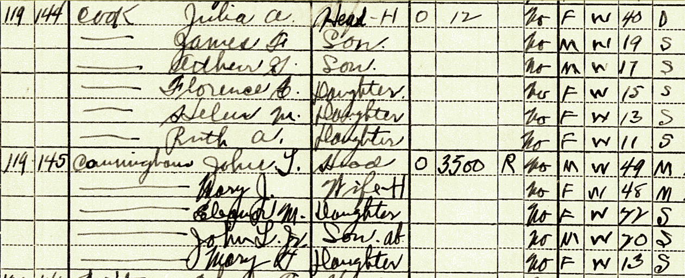

# Erin's family narrative (Maternal)

## Rosemary Bina
born:   
married: Gordon Lynch  

### Children
1. Katherine Anne
1. Erin Alison
1. Zachary Adam

### Places of residence

## Helen Cook
born: 1918  
married: Aloysius Bina  
died:  

### Children
1. 
1. 
1. 
1. 
1. 
1. 
1. 

### Places of residence

## Julia A. Gray
born: 1889  
married:  
divorced:  
died:  

### Children
1. 
1. 
1. 

### Places of residence
* 

### Records

* 1900 Census
	* [FamilySearch link]()
	* [Census page](3-Gray/Julia-Gray-1900-census-original.jpg)

* 1910 Census
	* [FamilySearch link]()
	* [Census page](3-Gray/Julia-Gray-1910-census-original.jpg)

In 1910, Julia lived with her husband Frederick two doors down from her father,
his new wife Mary, her brothers Charles (17) and Frederick (12), and half-brothers James (6), Calvin (3), and George (2 mo).

* 1920 Census
	* [FamilySearch link]()
	* [Census page](3-Gray/Julia-Gray-1920-census-original.jpg)

* 1930 Census
	* [FamilySearch link]()
	* [Census page](3-Gray/Julia-Gray-1930-census.jpg)

By 1930, Julia had divorced her husband and was living with their children and another family.

* 1940 Census
	* [FamilySearch link]()
	* [Census page](3-Gray/Julia-Gray-1940-census.jpg)

In 1940, Julia was living with her oldest son James in what appears to be an apartment complex.

## Helen Marie Littlefield
born: 16 March 1862, Maine  
married: ~1884, James Barton Gray Sr. (1860 - 1951)  
died: 1900 (age 38)  
burial: Ledyard, New London, CT  

### Records

* 1880 Census
	* [FamilySearch link](https://www.familysearch.org/ark:/61903/1:1:MFQH-BL6) 
	* [image (page 1)](4-Littlefield/1880-census-original-Helen-M-Littlefield.jpg) 
	* [image (page 2)](4-Littlefield/1880-census-original-p2-Helen-M-Littlefield.jpg)

* 1900 Census
	* [FamilySearch link]()
	* [image](3-Gray/Julia-Gray-1900-census-original.jpg)

### Children

### Places of residence
* 1880 Census - Kittery, York, Maine

### Notes

James Barton Gray Sr. married again - Mary Abby Littlefield (1869 - 1927)
Mary was a widow. First marriage 28 Sep 1893 to James Monroe Church Jr. He had a son
from a previous marriage? Clifford M. Church (1888 - 1906) died at age 17 in Haverhill, MA.

1862 - Helen Marie Littlefield born  
1884 - Helen marries James Barton Gray Sr.   
??? children  
1900 - Helen dies (age 38)  

## Caroline 
born: March 1837, NH  
married: George W. Littlefield (1838 - )
died:  
burial:  

### Records

* 1860 Census
	* [FamilySearch Link](https://www.familysearch.org/ark:/61903/1:1:MDCS-F3K)
	* [image](4-Littlefield/1860-census-original-Caroline-Littlefield.jpg)

* 1880 Census
	* [FamilySearch link](https://www.familysearch.org/ark:/61903/1:1:MFQH-BL6) 
	* [image (page 1)](4-Littlefield/1880-census-original-Helen-M-Littlefield.jpg) 
	* [image (page 2)](4-Littlefield/1880-census-original-p2-Helen-M-Littlefield.jpg)

### Children
1. Franklin H. 1859 (1880, 21, sailor)  
1. Annie G. 1860-? (not in 1880 census, probably married?)
1. Helen M. 1862  
1. Ida O. 1865  (m. Dicker)
1. Mary A. 1870  
1. Carrie J. 1874  
1. Edeth M. 1876 (?, relationship column in 1880 C. is blank)  
1. Roland H. 1878  

* Also in home at 1880 Census was Frank H. Smith (age 2), grandson - although all children are marked as single (not married, widowed or divorced).

* In 1880, Helen (18), Ida (15), and Mary (10) were not attending school. Carrie (6) and Edeth (4), were.

* In 1900, Caroline lived with her daughter Ida Dicker (37) and son Roland (22) in New London, CT. She was widowed and had 6 living children.

## Places of residence
* 1860 - Town of Wells, York, Maine
* 1970 - 
* 1880 - Kittery, York, Maine
* 1890 - 
* 1900 - Groton township, New London, CT

* Mother's birthplace Maine. Father's NH.
